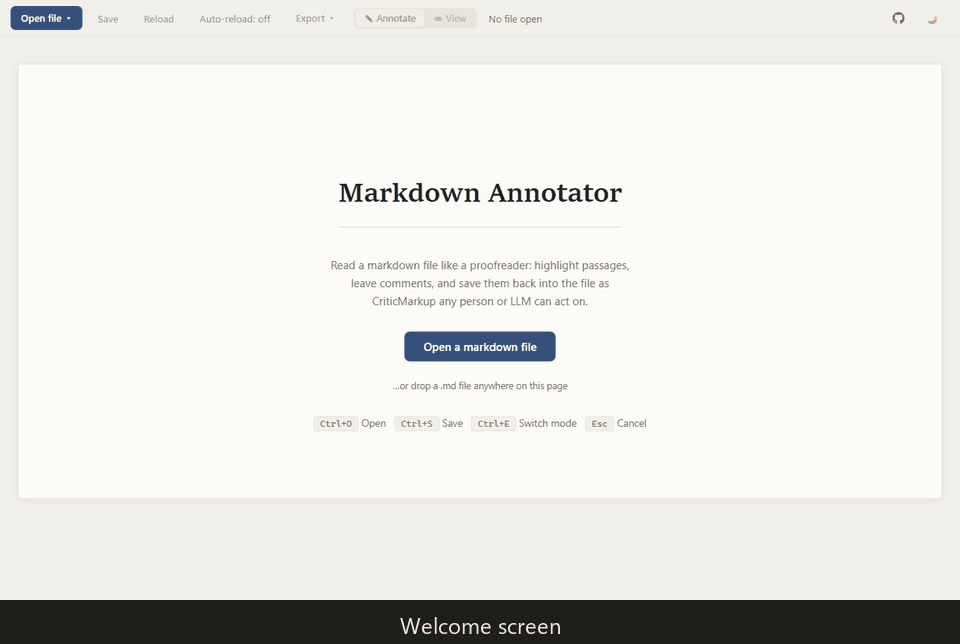

# Markdown Annotator

A browser-only tool for reviewing markdown documents like a proofreader: highlight passages, leave comments, review suggested edits already in a file, and save everything back as [CriticMarkup](https://criticmarkup.com/) that any person or LLM can read and act on.

**No server, no build, no install.** Serve the folder from any static host and start annotating files on your own disk.



## Why

Reviewing LLM-generated (or human-written) markdown usually means pasting text back and forth. This tool keeps the feedback *in the file*: comments and suggested edits live in the markdown source as plain-text CriticMarkup, so an LLM working in the same folder can read your notes, address them, and rewrite the file — which the annotator picks up and shows you for the next round.

## Features

### Commenting
- **Inline comments** — select any text (a word, a phrase, across paragraphs) and attach a comment; the passage gets an amber highlight with the comment as a badge right beside it. Stored as `{==text==}{>>comment<<}`.
- **Point comments** — click anywhere in the text to drop a note at that exact spot (`{>>comment<<}`).
- **Diagram comments** — click a rendered mermaid diagram to comment on the whole diagram.
- **Structure protection** — spots that can't be annotated without breaking the markdown formatting are refused with a notice; messy selections degrade gracefully to annotating what they can.

### Suggested edits
- A **replacement** (`{~~old~>new~~}`), **deletion** (`{--gone--}`), or **insertion** (`{++added++}`) written by an LLM (or anyone) directly into the file.
- Rendered as red strikethrough → green underline with keyboard-accessible **✓ accept / ✗ reject** controls, which rewrite the source accordingly.

### Reviewing
- **Everything in the document** — comments and suggestions live directly in the text; hover a badge to read a long comment in full, click any highlight to edit it.
- **Annotation navigator** — count, next/previous controls, and a compact list make long review documents manageable without moving comments out of the text.
- **Annotate / View modes** (Ctrl+E) — View mode makes the document behave like a normal page: select, copy, click without popups; annotations stay visible but read-only.
- **Undo** (Ctrl+Z) — reverts annotation operations, 50 steps deep.

### Files
- **Real local files** — opens and saves directly to your disk via the File System Access API. Local file contents are not uploaded.
- **Sample document** — try selection, comments, tables, code, Mermaid, and suggested-edit review before granting file access; save it as a new local file if you want to keep it.
- **Drag & drop** a `.md` anywhere on the page to open it.
- **Folder mode** — open a directory; a sidebar lists every markdown file in the tree.
- **GitLab mode** — open a markdown file straight from a GitLab repo (gitlab.com or self-hosted, personal access token, browser-to-GitLab only — no middleman server). Slash-containing branch names are supported. Tokens stay in tab memory unless you explicitly choose **Remember this token on this device**. Saving commits to the branch you opened from, with conflict detection if the file changed remotely; the watcher polls for new commits just like it watches local files.
- **Recent files** — one click away in the Open file dropdown; the last file reopens automatically after a page refresh (new tabs start clean).
- **Auto-save** — optional: local files save themselves ~1.5 s after your last change (GitLab files stay manual, so every commit is deliberate).
- **Disk watching** — the app notices when the open file changes on disk (an LLM rewriting it, another editor saving). Default: a banner offers to reload. Flip the **Auto-reload** toggle in the left rail to have clean files reload silently; conflicting unsaved changes always warn first.

### Comfort
- **Dark mode** (🌙, follows system preference), **installable as a PWA** (registers as a `.md` handler; installed apps also get persistent file permissions, so restores are silent), **mermaid diagrams** rendered inline with right-click copy/download as image, **code highlighting** via highlight.js.

## The LLM workflow

1. Open the doc and mark it up with comments for questions or requested fixes.
2. Save (Ctrl+S). The CriticMarkup is now in the file.
3. Point your LLM (Claude Code, etc.) at the file: *"address the CriticMarkup comments"*. The markup format is plain text and self-explanatory.
4. The LLM edits the file; the annotator sees the disk change and reloads (or offers to).
5. Review its suggested edits with ✓ / ✗. Repeat.

## Keyboard shortcuts

| Key | Action |
| --- | ------ |
| Ctrl+O | Open file |
| Ctrl+S | Save |
| Ctrl+E | Toggle Annotate / View mode |
| Ctrl+Z | Undo last annotation change |
| Esc | Close popup / menu |

## Requirements

A Chromium browser (Chrome or Edge) — the File System Access API is not available in Firefox/Safari.

## Run

Any static file server, e.g.:

```
python -m http.server 8038
```

then open http://localhost:8038. (The File System Access API doesn't work from `file://` pages, so serve it.)

## Development

- `index.html` — markup + styles (design tokens in `:root`, dark set under `:root[data-theme="dark"]`).
- `app.js` — browser integration (file I/O, rendering, dialogs, and UI).
- `app-helpers.js` — browser-independent GitLab URL, source-mapping, and navigator helpers.
- `annotator-core.js` — the CriticMarkup engine: parsing, group model, accept/reject, structure-preserving insertion. Pure functions, no DOM — also loads in Node.
- Unit tests: `node --test "tests/*.test.js"`.
- Browser tests: install the CI-only dependencies with `npm install --no-save --no-package-lock playwright@1.55.0 markdown-it@14.1.0 mermaid@11.16.0`, run `npx playwright install chromium`, then `node tests/browser-e2e.cjs`. CI drives selection, keyboard controls, sample onboarding/save, PAT privacy, dialogs, OPFS persistence, and Mermaid in real Chromium.

## License

MIT
