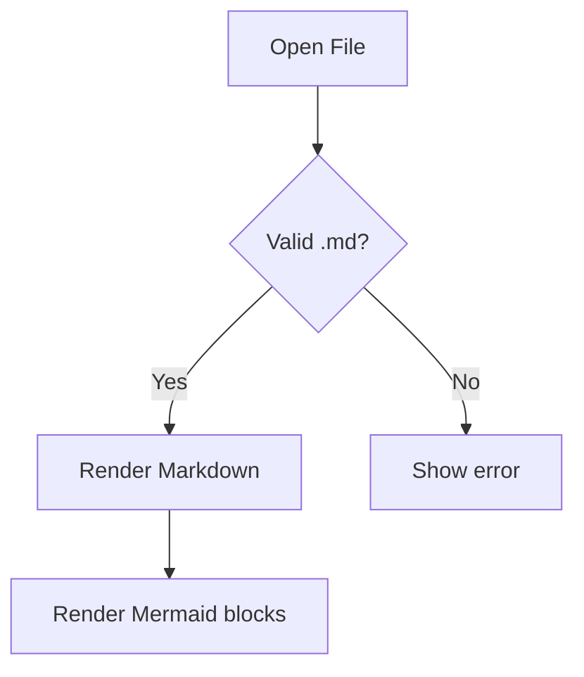
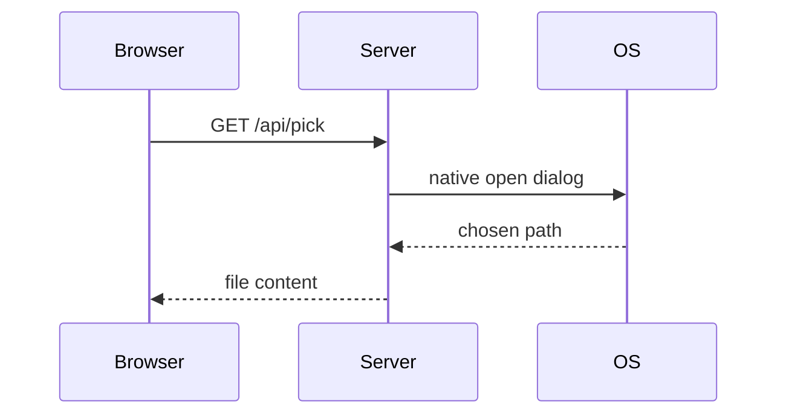

# Mermaid Test

Some intro text. Select this sentence to check annotations still work.

## Flowchart



## Sequence



## Regular code (should still highlight, not render)

```python
def hello():
    print("still a normal code block")
```
